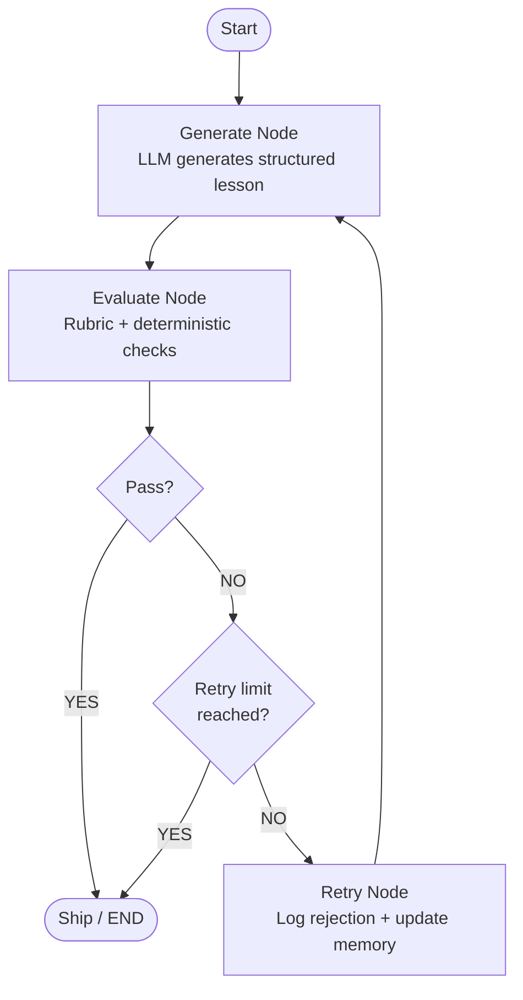

# Self-Evaluating RAG Lesson Agent

An agentic GenAI system that generates a beginner-friendly lesson on **Retrieval-Augmented Generation (RAG)**, evaluates its own output against a strict PASS/FAIL rubric, learns from failures, and only ships content that clears the quality gate.

> "The system does not trust its first generation. It generates, evaluates, learns from failure, and only ships content that clears the quality gate."

---

## 1. Problem Statement

Generating educational content is not only a generation problem.

A lesson can be technically incorrect, too difficult for beginners, full of unexplained jargon, missing important concepts, poorly structured, or lacking useful examples — and still *look* polished at a glance.

A standard LLM call cannot detect its own failures. This project therefore implements a complete:

```
GENERATE → EVALUATE → REGENERATE → SHIP
```

loop. The evaluator independently checks every lesson against a strict rubric. If any required criterion fails, the failure reasons are fed back into the generator and the lesson is regenerated. The workflow has a bounded retry limit so it always terminates.

---

## 2. Assignment Objective

| # | Requirement | Implemented |
|---|---|---|
| 1 | Generate a standalone beginner lesson on "Introduction to RAG" | ✅ |
| 2 | Evaluate the lesson using a strict PASS/FAIL rubric | ✅ |
| 3 | Regenerate when any required check fails | ✅ |
| 4 | Terminate after a maximum of 1–2 retries | ✅ |
| 5 | Maintain a rejection log | ✅ |
| 6 | Persist learning from previous failures across runs | ✅ |
| 7 | Demonstrate self-evolving behavior | ✅ |
| 8 | Include automated tests | ✅ 15 tests |
| 9 | Include a deliberate error demo mode | ✅ |

---

## 3. Architecture



This is a LangGraph `StateGraph`. The graph nodes are:

| Node | Responsibility |
|---|---|
| `generate` | Call the LLM, produce a structured `Lesson` |
| `evaluate` | Run rubric + deterministic checks, produce `EvaluationResult` |
| `retry` | Log the rejection, extract learned rules, update persistent memory |

The `route_after_evaluation` function is a conditional edge that decides whether to ship or retry.

---

## 4. Why This Is an Agentic System

This system is agentic because:

- It **decides autonomously** whether to ship or retry based on evaluation results.
- It **modifies its own behavior** between attempts using evaluator feedback and persistent memory.
- It **routes its own workflow** through a conditional graph rather than running a fixed sequence.
- It **persists learned rules** across separate program executions — not just within one run.

The final lesson is the lesson that *passed evaluation*, not simply the last generated lesson.

---

## 5. Learner Profile

Every generation prompt includes the following learner profile:

> "A 12th-grade graduate from India with limited English vocabulary and no prior knowledge of AI or machine learning."

This profile is used by both the **generator** (to produce appropriate language) and the **evaluator** (to judge whether explanations are genuinely beginner-friendly).

---

## 6. Generator Design

**File:** `src/generator.py` | **Function:** `generate_lesson()`

- Calls the configured local Ollama LLM with `with_structured_output(Lesson)`.
- The LLM is given both a **system prompt** (teaching principles) and a **human prompt** (topic, learner profile, rubric requirements, memory rules, and prior rejection feedback).
- Returns a structured `Lesson` Pydantic object with `title`, `introduction`, `sections`, `examples`, and `key_takeaways`.

On retry attempts, the prompt includes:
- Feedback from the previous rejected attempt (specific failure reasons)
- Memory entries (generalised rules learned from past failures)

---

## 7. Evaluator Design

**File:** `src/evaluator.py` | **Function:** `evaluate_lesson()`

Evaluation is **two-stage**:

### Stage 1 — Deterministic structural checks (no LLM)

| Check | Fails if |
|---|---|
| Title present | `lesson.title` is blank |
| Introduction present | `lesson.introduction` is blank |
| Minimum sections | Fewer than 2 sections |
| Example present | `lesson.examples` is empty |
| Key takeaways present | `lesson.key_takeaways` is empty |

### Stage 2 — LLM rubric evaluation

The evaluator LLM receives the full lesson text alongside the rubric and must return a PASS or FAIL verdict with a specific reason for every criterion.

The `overall_pass` field is **recomputed** from the individual check results after the LLM responds — the LLM's own `overall_pass` value is overridden. This prevents an inconsistent `overall_pass=True` response when individual checks contain failures.

---

## 8. Rubric and PASS/FAIL Policy

**File:** `src/rubric.py`

Every criterion has a name, a description, and an explicit **pass condition**. The evaluator is instructed to judge every criterion independently.

| ID | Name | Pass Condition |
|---|---|---|
| `accuracy` | Technical Accuracy | No significant technical inaccuracies |
| `beginner_friendly` | Beginner Friendly | Simple language, no assumed AI knowledge |
| `jargon` | Jargon Handling | Technical terms explained before first use |
| `rag_fundamentals` | RAG Fundamentals | Learner can explain the basic RAG pipeline |
| `why_rag` | Why RAG Matters | Clear reason for using RAG over base model knowledge |
| `example` | Concrete Example | At least one step-by-step example of how RAG works |
| `coherence` | Teaching Flow | Logical progression, no conceptual jumps |
| `standalone` | Standalone Completeness | Lesson requires no external resources |

A **single failed criterion** causes `overall_pass = False` and triggers regeneration.

---

## 9. Retry / Regeneration Mechanism

**File:** `src/nodes.py` — `route_after_evaluation()`, `retry_node()`

```
attempt < max_retries AND evaluation.overall_pass == False → retry
attempt >= max_retries OR evaluation.overall_pass == True  → ship
```

- `MAX_RETRIES` defaults to `2` and is configurable via the `.env` file.
- There is **no possibility of an infinite loop** — the retry counter always increments and is always checked before looping.
- On retry, `build_feedback()` constructs a detailed feedback string listing every failed criterion and its reason. This string is injected directly into the next generation prompt.

---

## 10. Rejection Logging

**File:** `src/schemas.py` — `RejectionLog` | **File:** `src/nodes.py` — `create_rejection_log()`

Every failed attempt is recorded as a `RejectionLog` containing:

| Field | Contents |
|---|---|
| `attempt` | Attempt number |
| `status` | Always `"REJECTED"` for logged failures |
| `failures` | `"check_name: evaluator reason"` for every failed check |
| `reasons` | Raw evaluator reason strings |
| `corrections` | `"Fix check_name based on evaluator feedback: ..."` |

All rejection logs for a run are stored in `AgentState["rejection_logs"]` and are included in the output report at `outputs/run_report.md`.

---

## 11. Persistent Memory

**File:** `src/memory.py` | **Storage:** `data/memory.json`

After each rejected attempt, `update_memory()`:

1. Parses the `failure_type` from the rejection log.
2. Normalises it (e.g. `"Technical Accuracy (accuracy)"` → `"technical accuracy"`).
3. Maps it to a **reusable learned rule** via `build_learned_rule()`.
4. Checks whether an identical rule already exists in memory.
   - If yes: increments the `frequency` counter (deduplication).
   - If no: appends a new `MemoryEntry`.
5. Writes the updated memory to `data/memory.json`.

On the next program execution, `load_memory()` reads the file and includes all learned rules in the generation prompt.

### Memory schema

```json
[
  {
    "failure_type": "accuracy",
    "reason": "RAG retrains the model ...",
    "learned_rule": "Verify technical claims carefully. Never describe RAG as retraining the model during a user query.",
    "frequency": 1
  }
]
```

Memory storage is a flat JSON file — **not a vector database**. This is appropriate for the scale of this project.

---

## 12. Self-Evolving Behavior

The system evolves across executions:

1. **Run 1, Attempt 1:** Lesson fails Technical Accuracy.
2. **Retry Node:** Failure is converted to a learned rule and saved to `data/memory.json`.
3. **Run 1, Attempt 2:** Next generation receives the learned rule in its prompt.
4. **Run 2:** Memory is loaded from disk. Even the first attempt in Run 2 benefits from rules learned during Run 1.

The frequency counter ensures repeated failures raise the priority of the corresponding rule without creating duplicate entries.

---

## 13. Deliberate Error / Demo Mode

**File:** `src/config.py` — `DEMO_MODE` | **File:** `src/generator.py` — `inject_demo_error()`

When `DEMO_MODE = True`, the generator appends the following text to the lesson introduction after the LLM generates an otherwise correct lesson:

```
Incorrect demo claim: RAG retrains the AI model every time a user asks a question.
```

This is used for Loom demonstrations to show the self-correction loop in action:

1. The LLM generates a correct lesson.
2. The demo error is injected.
3. The evaluator catches it as a **Technical Accuracy** failure.
4. The lesson is rejected, a learned rule is saved, and feedback is built.
5. The regenerated lesson (without the demo error) passes all criteria.

**The demo error does NOT contaminate the final shipped lesson.** The retry generates a fresh lesson from scratch — the error is only injected on generation calls where `DEMO_MODE=True`, and the corrected lesson comes back clean.

> To disable demo mode: set `DEMO_MODE = False` in `src/config.py`.

---

## 14. Project Structure

```
self-evaluating-rag-lesson-agent/
├── src/
│   ├── config.py          # Environment config and constants
│   ├── schemas.py         # Pydantic models (Lesson, EvaluationResult, RejectionLog, MemoryEntry)
│   ├── state.py           # AgentState TypedDict for LangGraph
│   ├── rubric.py          # 8-criterion PASS/FAIL rubric
│   ├── prompts.py         # Generator system prompt + dynamic prompt builder
│   ├── llm.py             # Ollama LLM factory
│   ├── generator.py       # Lesson generation + demo error injection
│   ├── evaluator.py       # Deterministic checks + LLM rubric evaluation
│   ├── memory.py          # Load, save, update, and normalise persistent memory
│   ├── nodes.py           # LangGraph node functions + routing logic
│   ├── workflow.py        # StateGraph construction and compilation
│   ├── output.py          # Save lesson.md, evaluation_report.json, run_report.md
│   └── main.py            # Entry point
├── tests/
│   ├── test_evaluator.py      # Deterministic structural checks
│   ├── test_generator.py      # Memory formatting
│   ├── test_llm.py            # LLM object creation
│   ├── test_memory.py         # Learned rule generation
│   ├── test_output.py         # Output file creation
│   ├── test_retry_workflow.py # Retry routing + feedback generation
│   ├── test_rubric.py         # Rubric structure and content
│   └── test_workflow.py       # Routing: ship vs retry vs limit
├── data/
│   └── memory.json        # Persistent memory (runtime artifact, gitignored)
├── outputs/               # Generated lesson and reports (gitignored)
│   ├── lesson.md
│   ├── evaluation_report.json
│   └── run_report.md
├── .env                   # Local secrets (gitignored)
├── .gitignore
├── pytest.ini
├── requirements.txt
└── README.md
```

---

## 15. Technology Stack

| Component | Technology |
|---|---|
| Agent framework | [LangGraph](https://github.com/langchain-ai/langgraph) |
| LLM client | [LangChain Ollama](https://python.langchain.com/docs/integrations/llms/ollama) |
| Local inference | [Ollama](https://ollama.com) |
| Default model | `qwen3:14b` |
| Structured output | Pydantic v2 + `with_structured_output()` |
| Memory storage | JSON file (`data/memory.json`) |
| Testing | pytest |
| Python | 3.13 |

### Why Ollama / local inference?

- **Privacy:** Lesson content and evaluation results never leave the local machine.
- **Cost:** No API billing per generation or evaluation call.
- **Reproducibility:** Fixed model version with `temperature=0` for deterministic evaluation.
- **Offline:** Works without an internet connection after the model is pulled.

The LLM provider and model are configurable via environment variables, so switching to a cloud provider requires no code changes.

---

## 16. Setup Instructions

### Prerequisites

- Python 3.13+
- [Ollama](https://ollama.com) installed and running
- The `qwen3:14b` model pulled (or any model you configure)

```bash
ollama pull qwen3:14b
```

### Install dependencies

```bash
python -m venv .venv
source .venv/bin/activate      # Windows: .venv\Scripts\activate
pip install -r requirements.txt
```

### Environment configuration

Create a `.env` file in the project root:

```bash
OLLAMA_BASE_URL=http://localhost:11434
MODEL_NAME=qwen3:14b
MAX_RETRIES=2
```

| Variable | Default | Description |
|---|---|---|
| `OLLAMA_BASE_URL` | `http://localhost:11434` | Ollama server URL |
| `MODEL_NAME` | `qwen3:14b` | Model to use |
| `MAX_RETRIES` | `2` | Maximum generation attempts |

> `DEMO_MODE` is controlled in `src/config.py`, not via `.env`.

---

## 17. How to Run

```bash
# Normal run (set DEMO_MODE=False in src/config.py)
python -m src.main

# Demo run (set DEMO_MODE=True in src/config.py first)
python -m src.main
```

The agent will:
1. Load memory from `data/memory.json` (if it exists)
2. Generate a lesson
3. Evaluate the lesson against the rubric
4. Retry if any criterion fails (up to `MAX_RETRIES` times)
5. Print the final result and save output files to `outputs/`

---

## 18. How to Run Tests

```bash
pytest -v
```

All 15 tests run without network calls. The LLM is never invoked during the test suite.

```
tests/test_evaluator.py::test_empty_lesson_fails_structure PASSED
tests/test_evaluator.py::test_valid_structure_passes PASSED
tests/test_generator.py::test_format_memory PASSED
tests/test_llm.py::test_llm_can_be_created PASSED
tests/test_memory.py::test_accuracy_memory_rule PASSED
tests/test_memory.py::test_jargon_memory_rule PASSED
tests/test_output.py::test_output_files_are_created PASSED
tests/test_retry_workflow.py::test_bad_lesson_is_rejected PASSED
tests/test_retry_workflow.py::test_bad_lesson_stops_after_retry_limit PASSED
tests/test_retry_workflow.py::test_failed_evaluation_creates_regeneration_feedback PASSED
tests/test_rubric.py::test_rubric_has_required_checks PASSED
tests/test_rubric.py::test_rubric_text_contains_all_checks PASSED
tests/test_workflow.py::test_passed_evaluation_ships PASSED
tests/test_workflow.py::test_failed_evaluation_retries PASSED
tests/test_workflow.py::test_retry_limit_terminates PASSED

15 passed in 0.21s
```

---

## 19. Example: Successful Run (DEMO_MODE=False)

```
============================================================
FINAL RESULT
============================================================

Title: Introduction to RAG (Retrieval-Augmented Generation)

Overall evaluation: True
Attempts: 1

Evaluation checks:
- Technical Accuracy (accuracy): PASS — The lesson correctly states that RAG does not retrain the model...
- Beginner Friendly (beginner_friendly): PASS — Language is simple and direct...
- Jargon Handling (jargon): PASS — Terms like retrieval, augmentation, generation are explained...
- RAG Fundamentals (rag_fundamentals): PASS — Three-step pipeline is explained clearly...
- Why RAG Matters (why_rag): PASS — Lesson explains why RAG is useful for recent information...
- Concrete Example (example): PASS — Step-by-step example demonstrates the full pipeline...
- Teaching Flow (coherence): PASS — Lesson progresses logically...
- Standalone Completeness (standalone): PASS — Sufficient context provided...

Rejection logs:
(none)
```

---

## 20. Example: Demo Run (DEMO_MODE=True)

```
============================================================
FINAL RESULT
============================================================

Title: Introduction to RAG (Retrieval-Augmentation-Generation)

Overall evaluation: True
Attempts: 2

Evaluation checks:
- Technical Accuracy (accuracy): PASS — The lesson correctly states that RAG does not retrain the AI model...
... all other checks: PASS

Rejection logs:

Attempt 1
- Technical Accuracy (accuracy): The lesson explicitly includes a false statement:
  'Incorrect demo claim: RAG retrains the AI model every time a user asks a question.'
```

**What happened:**
- Attempt 1: Demo error injected → evaluator catches Technical Accuracy FAIL → rejected.
- A learned rule is saved to `data/memory.json`.
- Attempt 2: Generator receives rejection feedback + learned rule → produces a correct lesson → all 8 criteria pass.

---

## 21. Design Decisions

### LangGraph for the workflow

LangGraph makes the agentic architecture explicit and inspectable. The graph topology (nodes, edges, conditional routing) is declared separately from the business logic. Adding a new node (e.g. a human review step) requires no rewiring of control flow.

### Pydantic structured output

Using `llm.with_structured_output(Lesson)` forces the LLM to return a validated schema. This eliminates parsing fragility — if the LLM returns an invalid structure, Pydantic raises immediately rather than silently producing corrupt data.

### LLM-as-judge for evaluation

The evaluator uses the same LLM as the generator. This is a trade-off: the LLM may be lenient about its own failures. This is mitigated by:
- Deterministic structural checks that catch basic failures before the LLM evaluator runs.
- A strict system prompt instructing the evaluator to be critical, not generous.
- `overall_pass` being recomputed from individual check results, not taken from the LLM's top-level answer.

### Memory as JSON

Memory is stored as a flat JSON file rather than a vector database. For this project, the number of failure types is bounded (8 rubric criteria), so semantic search is not needed. The JSON file is human-readable and requires no additional infrastructure.

---

## 22. Current Limitations

- **LLM evaluator subjectivity:** The evaluator LLM may occasionally pass borderline lessons or fail good ones.
- **Single topic:** The system is built specifically for "Introduction to RAG".
- **No vector memory:** Memory rules are matched by category string. Unknown check names fall through to a generic fallback.
- **Local inference latency:** Each generation + evaluation cycle takes 20–60 seconds depending on hardware.
- **Memory not scoped by topic:** If used for multiple topics, memory from one topic may interfere with another.

---

## 23. Future Improvements

- Make rubric and memory rules configurable per topic via YAML.
- Add a vector-based memory store (e.g. ChromaDB) for semantic rule retrieval at scale.
- Surface intermediate evaluation results via a simple web UI.
- Add a human-in-the-loop override before shipping.
- Support cloud LLM providers (OpenAI, Gemini) as drop-in alternatives.

---

## 24. Final Summary

This project demonstrates a working agentic loop built on LangGraph in which:

- The **generator** produces a structured beginner lesson, informed by learned memory and prior rejection feedback.
- The **evaluator** independently judges the lesson against an 8-criterion PASS/FAIL rubric using both deterministic structural checks and an LLM judge.
- The **retry node** logs failures, extracts generalised learning rules, and updates persistent memory.
- The **router** guarantees termination by capping retries and always shipping after the limit.
- The **memory system** persists learned rules to disk, making the system incrementally smarter across separate executions.

The final lesson is not simply the last generated lesson — it is the lesson that cleared the quality gate.
